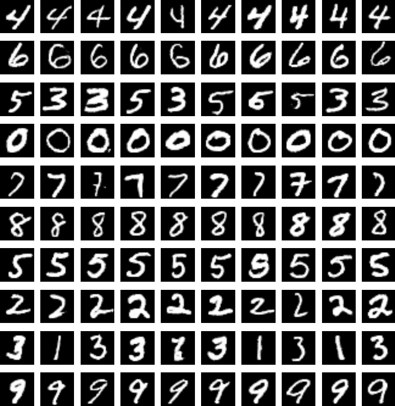
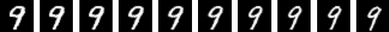
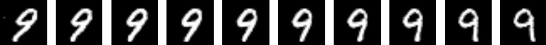

# InfoGAN

Chainer implementations of *InfoGAN: Interpretable Representation Learning by Information Maximizing Generative Adversarial Nets*  [http://arxiv.org/abs/1606.03657](http://arxiv.org/abs/1606.03657).

## MNIST Latent Codes

- c<sub>1</sub> ~ Cat(K = 10, p = 0.1)
- c<sub>2</sub> ~ Unif(-1, 1)
- c<sub>3<sub/> ~ Unif(-1, 1)

10 categorical and 2 continuous codes are sampled and concatenated with 62 noise variables z and then fed into the generator.
k

### c<sub>1</sub> - 10 Categorical



### c<sub>2</sub> - Continuous, Interpolation




### c<sub>3</sub> - Continuous, Interpolation




## Run

### Train

```bash
python train.py --out-generator-filename ./trained/generator.model --gpu 0
```
